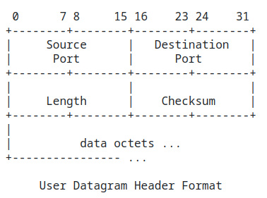
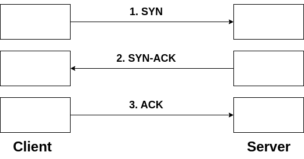
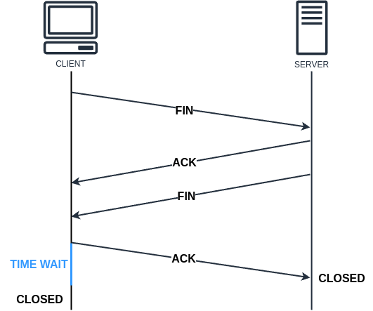
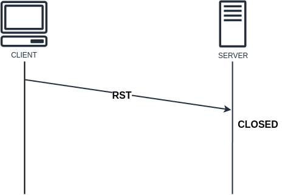
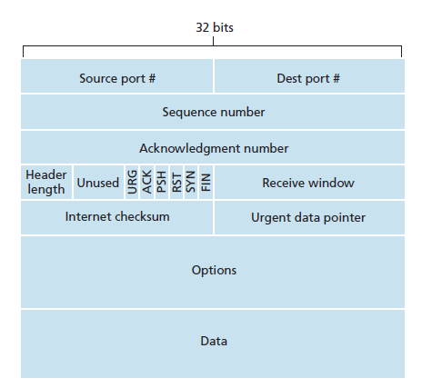
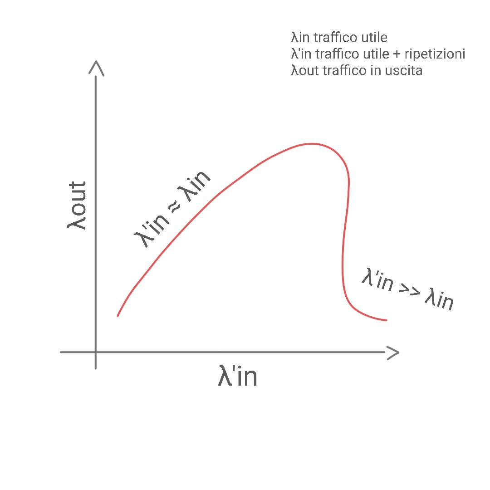
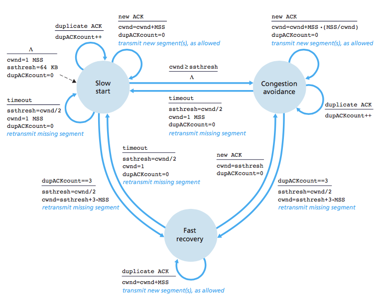
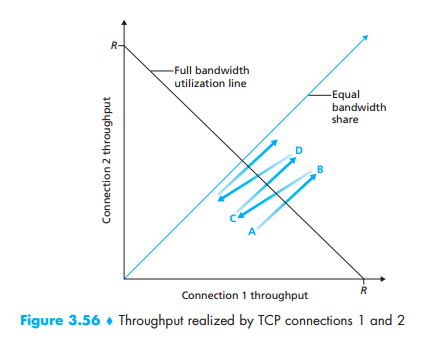

# Livello di trasporto 

Un protocollo a livello di trasporto mette a disposizione una **comunicazione logica tra processi applicativi residenti su host differenti**. Con la dicitura *comunicazione logica* intendiamo che gli host eseguono i processi come se fossero direttamente connessi. A questo livello i protocolli sono implementati nei sistemi periferici e non nei router che fanno parte della rete.

I messaggi di livello di trasporto sono detti **segmenti** (transport-layer segment). Se necessario, un messaggio di livello applicativo viene spezzato ed inoltrato utilizzando più segmenti. Il livello di trasporto passa poi il proprio segmento a quello di rete, dove viene incapsulato in un **datagramma IP** (IP datagram) e inviato a destinazione.

I router, il cui compito è recapitare il messaggio, agiscono solo sui campi del datagramma, senza esaminare i campi del segmento incapsulato al suo interno (datagram payload).

## Multiplexing/demultiplexing di livello di trasporto

Su due host possono esserci più processi in ascolto, tutti in attesa di un qualche messaggio proveniente dalla rete o bisognosi di inoltrarne. Questo processo di identificazione è detto **multiplexing (in invio) e demultiplexing (in ricezione)**.


Per identificare univocamente i processi all'interno degli host ci appoggiamo al concetto di **porta (port)**, un'astrazione che ci consente questa identificazione univoca. Va precisato che per mittente e destinatario i numeri di porta non devono essere uguali (spesso non lo sono), basta che ciascuno sia informato del numero di porta dell'altro.

La porta è espressa da un intero a $16$ bit. All'interno di ciascun host possiamo dunque avere $2^{16}$ porte, vale a dire da $0$ a $65535$ porte.

Le porte sono poi classificate a seconda del range in cui si trovano:

- Da $0$ a $1023$ troviamo le porte destinate ai servizi noti
  - HTTP su porta $80$
  - HTTPS su porta $443$
  - SMTP su porta $25$
  - DNS su porta $53$​
- Da $1024$ a $65535$ troviamo le porte destinabile agli altri servizi, dove nello specifico:
  - Le porte da $1024$ a $49151$​ sono destinate a servizi che hanno successo su larga scala e la cui licenza di utilizzo va richiesta al **Internet Assigned Numbers Authority (IANA)**
  - Le restanti sono pienamente libere

## Livello di trasporto per Internet

Internet, più in generale le reti di tipo TCP/IP, mettono a disposizione del livello applicativo due differenti protocolli.

- **UPD (User Datagram Protocol)**: fornisce all'applicazione un servizio **non affidabile e connection-less**
- **TCP (Transmission Control Protocol)**: fornisce all'applicazione un servizio **affidabile e connection-oriented**

In qualità di sviluppatori delle applicazioni, abbiamo l'onere di scegliere il protocollo di livello di trasporto che vorremmo utilizzare, preferibilmente previa un'accurata analisi dei requisiti. Scegliamo uno tra questi due protocolli nel momento in cui creiamo le socket per il nostro applicativo.

Il protocollo a livello di rete dello stack Internet è IP (Internet Protocol) fornisce comunicazione logica tra due host all'interno della rete. Il suo modello di servizio è noto come **best-effort delivery service** o semplicemente **best-effort**, vale a dire che **non offre alcuna garanzia sulla ricezione, su l'ordine o sull'integrità**. Diciamo quindi che il servizio offerto da IP è **inaffidabile**. 

Nel caso di UDP questa inaffidabilità viene mantenuta, mentre TCP cerca di garantire ordine e ricezione, per fare ciò su un sistema come quello IP, TCP introduce una notevole complessità sul piano di trasporto.

### UDP

Definito nel [RFC 768](https://datatracker.ietf.org/doc/html/rfc768), UDP è un protocollo a livello di trasporto che offre un servizio minimale e privo di garanzie. Identifichiamo i due principali (ed unici) servizi offerti:

- Funzione di multiplexing / demultiplexing
- Controllo (ma non correzione) degli errori

Il sistema di consegna di UDP è, come IP, di tipo best-effort. I segmenti di tipo UDP possono quindi venire smarriti o duplicati (nel caso di ritrasmissione).

Quando utilizziamo UDP i messaggi provenienti dal livello applicativo vengono addizionati con il numero di porta di origine e destinazione e due header di intestazione, dopo di che vengono passati al livello sottostante, senza prima creare un canale di comunicazione logico o un qualche tipo di sessione.

L'assenza di handshaking, che invece ritroviamo in TCP, rende UDP un protocollo **connection-less**. I segmenti sono indipendenti tra loro, non legati logicamente da un canale di comunicazione che li trasporti tutti.

#### Struttura dei datagrammi/segmenti UDP

I segmenti di tipo UDP sono anche noti come **datagrammi (datagram)**. Questo può spesso generare confusione perchè datagramma è anche il termine con cui ci si riferisce ai pacchetti di livello IP. Useremo il termine datagramma per UDP nei contesti dove non è presente ambiguità.



L'intestazione UDP presenta **quattro campi di due byte ciascuno**.

- I **numeri di porta** consentono all'host di destinazione di trasferire i dati applicativi al processo corretto (azione di demultiplexing).
- Il campo **lunghezza** specifica il numero di byte del segmento UDP (intestazione + dati), questo valore è necessario vista la lunghezza variabile del campo dati.
- Il **checksum** può venire utilizzato dall'host destinatario per verificare la presenza di eventuali errori nel segmento.

Lato mittente il checksum viene costrutito effettuando il **complemento ad 1 della somma di tutte le parole da 16 bit nel segmento**, e l'eventuale riporto finale viene sommato al primo bit. Il complemento a 1 si ottiene convertendo i bit 0 in 1 e viceversa. In ricezione si sommano le parole iniziali e il checksum. Se non ci sono errori nel segmento, l'addizione darà una stringa contenenti tutti 1. La presenza degli 0 è quindi indice della presenza di un errore.
Nonostante la presenza di un sistema di controllo degli errori, il protocollo non ne prevede la correzione. Alcune implementazioni di UDP si limitano a scartare il pacchetto, mentre altre lo inoltrano a livello superiore con un avvertimento.

#### Applicazioni di UDP

- Domain Name System (DNS) per la risoluzione dei domini
- Simple Network Management Protocol (SNMP) per il controllo di stato della rete
- Routing Information Protocol (RIP) Informazioni sullo stato della rete
- Dynamic Host Configuration Protocol (DHCP) Assegnazione indirizzi IP

### TCP 

TCP è un protocollo di livello di trasporto che offre un servizio di consegna **affidabile e connection-oriented**, partendo da un canale inaffidabile come quello di livello IP. È definito nel [RFC 9293](https://datatracker.ietf.org/doc/html/rfc9293).

Con il termine *orientato alla connessione* (connection-oriented) intendiamo che, prima di mandare un messaggio (che magari trasporti del contenuto proveniente dal livello applicativo), abbiamo bisogno di scambiare messaggi di servizio, utili per instaurare una connessione. Questo preambolo prende il nome di **3-way handshake**.



L'handshake di TCP permette agli host di **riconoscere la mutua presenza in un determinato istante**, instaurando una connessione logica. Nel gergo il riconoscimento della mutua presenza prende spesso il nome di **challenge**. Quando si viene a creare una connessione TCP il server riserva inoltre un certo quantitativo di risorse alla suddetta connessione.

Una volta stabilita la connessione, ogni qual volta viene mandato un messaggio segue un messaggio di **ACK (acknowledgement)**, un feedback sulla ricezione del segmento da parte della controparte. I segmenti di ACK, esattamente come quelli ordinari che trasportano dati di livello applicativo, possono venire persi. In questo caso il protocollo prevede il reinoltro del pacchetto. La notifica di un evento di perdita è generalmente data da un timer.

Supponiamo che il server abbia ricevuto un messaggio da parte del client e voglia fornire un ACK, che viene però perso durante la trasmissione. Se entro un tempo limite non viene fornito un ACK per un determinato messaggio, il client suppone che il proprio messaggio sia andato perso, perciò lo inoltra nuovamanete. Il server alla ricezione del messaggio duplicato può dedurre che il proprio ACK sia andato perso, si limita dunque a mandare nuovo ACK e scartare il messaggio duplicato. 

La chiusura di una connessione avviene in maniera analoga all'apertura, tipicamente per volontà del client. Può avvenire in una delle seguenti modalità:

- **gentile**

  - Si susseguono due coppie di messaggi FIN ed ACK.

    

- **con messaggio di reset**, fatto in caso di crash di uno dei due

  - Un unico messaggio, proveniente da una sola delle due parti. Può essere sia il client che il server a mandarlo.

    


#### Struttura dei segmenti TCP



Analizziamo alcuni dei campi di un segmento TCP.

Oltre ai numeri di porta già visti e il cui utilizzo è a questo punto intuibile, troviamo diversi header utili per garantire alcune delle proprietà più note di TCP.

- Numero di sequenza: per il recapito in ordine e l'avanzamento della comunicazione. È proprio grazie alla presenza dei numeri di seguenza che riusciamo a legare un flusso di dati.
- Code bits: indica il tipo di pacchetto (SYN, ACK, FIN etc...)
- Receive window size: riporta la dimensione della finestra di ricezione. Utilizzato per il controllo di flusso. Più il valore della finestra è piccolo più il traffico prodotto è limitato
- Checksum: per il controllo degli errori

####  Piggybacking

Una connessione TCP è di tipo **full-duplex**, vale a dire **bidirezionale**. Con un tale canale di comunicazione e la medesima struttura per i segmenti inoltrati da parte di mittente e destinatario potrebbe configurarsi il caso in cui il server ad esempio, oltre a mandare un messaggio di ACK, vorrebbe poter comunicare qualche altra informazione senza bisogno di un ulteriore dispendio nel creare e spedire un nuovo segmento. In questo caso il server si limiterà ad utilizzare il payload del segmento di ACK per il trasporto dati. Questa tecnica di ottimizzazione è detta **piggybacking**.


#### Svantaggi di TCP

Nonostante la sua affidabilità e le interessanti proprietà garantite TCP non è sempre la scelta ottimale per ogni applicativo. Non può ad esempio garantire che le comunicazioni avvengano in tempo reale vista la necessità di instaurare una connessione prima dello scambio di messaggi. UDP al contrario è più veloce, adatto per applicazioni dove si genera molto traffico che hanno bisogno di responsività, come ad esempio lo streaming video ed audio.

#### Controllo di flusso

Il controllo di flusso è un meccanismo di sincronizzazione che permette a due host, mittente e destinatario, di inviare e ricevere segmenti senza cadere in situazioni di stress. Questo è vero in particolare per il destinatario che potrebbe spesso trovarsi in una situazione per cui il mittente (e più in generale la rete) fornisca messaggi ad una velocità molto maggiore rispetto a quella che quest'ultimo ha nel processare il contenuto dei messaggi.

La già menzionata **finestra di ricezione**, anche nota come finestra a scorrimento o **sliding window**, è proprio il meccanismo sfruttato da TCP per garantire il controllo di flusso.
La dimensione della finestra di ricezione varia in funzione della capacità del destinatario di bufferizzare i messaggi ricevuti e degli ultimi messaggi effettivamente processati:
$$
RcvWindow = RcvBuffer \ - \ (LastByteRcvd - LastByteRead)
$$
Il mittente per rispettare la finestra di ricezione imposta dal destinatario conserva i dati già trasmessi ma per cui non ha ancora ricevuto ACK e limita la quantità in relazione all'ultimo valore di $RcvWindow$ noto. Quindi:
$$
LastByteSent \ – \ LastByteAcked \le RcvWindow
$$

##### Silly window syndrome

Potrebbe configurarsi lo scenario in cui la dimensione della finestra di ricezione tenda a zero per poi espandersi di poco e nuovamente azzerarsi in seguito all'invio dei segmenti (si dice anche che la finestra di ricezione tende a chiudersi). Una dimensione sempre ridotta della finestra di ricezione e conseguente deficit di performance dato dall'inoltro di segmenti corti con molto overhead porta alla **silly window syndrome** (sindrome da finestra sciocca, abbreviata con SWS). Questa inefficienza può essere causata sia dal mittente che dal destinatario.

- **Nel caso in cui sia dovuto al destinatario**: il buffer di ricezione viene svuotato troppo lentamente e vengono inoltrati indietro segmenti di ACK con una dimensione di finestra molto piccola. Il mittente in risposta invierà segmenti molto corti con molto overhead
- **Nel caso in cui sia dovuto al mittente**: l'applicazione genera di per sé pochi dati, di conseguenza vengono inoltrati a destinazione pochi segmenti

Questi due scenari hanno soluzioni differenti.

##### Soluzione di Clark

La soluzione di Clark è utilizzata in presenza di silly window syndrome causata dal destinatario e prevede che il destinatario indichi una finestra nulla finché il buffer di ricezione non si sia svuotato per metà o per una porzione uguale a MSS (Maximum Segment Size), l'unità massima di trasmissione.

##### Algoritmo di Nagle

L'algoritmo di Nagle è invece utilizzato quando la silly window syndrome è dovuta al flusso ridotto generato dal mittente. Definisce un metodo per stabilire una **connessione auto-temporizzata**, che non richiede l'utilizzo di cronometri locali. È discusso nel [RFC 896](https://datatracker.ietf.org/doc/html/rfc896) ed è così strutturato:

```pseudocode
if there is new data to send then
    if the window size ≥ MSS and available data is ≥ MSS then
        send complete MSS segment now
    else
        if there is unconfirmed data still in the pipe then
            enqueue data in the buffer until an acknowledge is received
        else
            send data immediately
        end if
    end if
end if
```

#### Controllo di congestione

La ritrasmissione eccessiva dei segmenti può riempire la rete di messaggi duplicati, finendo con il soffocare il traffico utile. I messaggi duplicati attendono nei buffer dei router ed impiegano risorse che altrimenti potrebbero venire destinate al traffico utile, per poi giungere a destinazione e venire scartati o non giungere proprio.

Quando le ripetizioni superano il traffico utile si verifica un **evento di congestione**, ovvero un soffocamento delle prestazioni della rete. **La maggiore causa di congestione è la scelta errata dei timer legati al reinvio dei segmenti**, per questo motivo è buona prassi stimare ed impostare correttamente i timer sulla base di una precedente diagnostica.



Le versioni classiche di TCP implementano un **controllo di congestione end-to-end** anziché assistito dalla rete, vale a dire che il livello IP non fornisce ai sistemi periferici alcun feedback esplicito per quanto riguarda la congestione della rete. Esistono ovviamente delle estensioni per avere anche notifica esplicita di congestione dalla rete.

In assenza di estensioni, l'approccio ottimale prevede l'imporre a ciascuno mittente un limite al tasso di invio sulla propria connessione in funzione della congestione di rete percepita. Se il mittente TCP si accorge di condizioni di scarso traffico sul percorso che porta alla destinazione, incrementa il proprio tasso di trasmissione. Se invece percepisce traffico lungo il percorso, lo riduce.

Il meccanismo di controllo di congestione di TCP prevede che gli estremi della connessione tengano traccia della **finestra di congestione (congestion window)**, indicata spesso come `cwnd`. Questa finestra di congestione impone un vincolo alla velocità di trasmissione da parte del mittente, nello specifico, la quantità di dati che non hanno ancora ricevuto acknowlegement inviata da un mittente non può eccedere il minimo tra i valori di `cwnd` e `rwnd`.
$$
LastByteSent - LastByteAcked \le min(cwnd, rwnd)
$$
Il vincolo sopra citato limita il tasso di trasmissione del mittente soltanto in modo indiretto però. Il tasso di invio del mittente è in media $\frac{cwnd}{RTT} \ byte/s$. Modificando il valore di `cwnd` il mittente regola la velocità di invio dei dati sulla propria connessione. La presenza di congestione sul percorso viene dedotta in presenza degli **eventi di perdita**. Per TCP un evento di perdita può essere:

- un timeout di ricezione
- la ricezione di 3 ack duplicati da parte del destinatario

Per evitare e controllare la congestione **(congestion avoidance, congestion control)** le varie metodologie si sono evolute nel tempo e differiscono a seconda della versione di TCP di riferimento. Più in generale, l'algoritmo di controllo di congestione si compone di due parti:

1. **Slow start**
2. **AIMD (Additive Increase Multiplicative Decrease)**

##### Slow start

L'approccio slow start, utilizzato a partire da **TCP Tahoe**, prevede l'invio di un segmento e conseguente raddoppio in caso di buona riuscita. Dopo una certa soglia, l'incremento avviene un segmento per volta. Allo scadere di un timer e conseguente **evento di perdita** viene effettuato un reset dello stato e la fase ricomincia dal principio.

Versioni seguenti di TCP, come ad esempio **TCP Reno**, hanno poi introdotto una terza fase di **fast recovery**, dove anzichè effettuare un reset totale la ripresa avviene da una determinata soglia, nonché un'azione di **fast retransmit**, dove all'arrivo di **3 ACK duplicati** viene reinoltrato un messaggio ma senza scatenare un evento di scadenza di timer.

Sono possibili due tipi di incremento:

- lineare
- esponenziale

I due tipi di incremento vengono opportunamente alternati per garantire una ripresa rapida ma evitare di arrivare nuovamente ad una situazione di congestione.



##### AIMD (Additive Increase Multiplicative Decrease)

L'approccio di incremento additivo e decremento moltiplicativo prevede uno stress incrementale sulla rete fino a giungere allo stato di congestione. Incontrata la congestione, si riduce in maniera moltiplicativa il flusso, così da lavorare a regime senza raggiungere lo stato di congestione.


Ulteriori informazioni sul controllo di congestione sono [qui](https://en.wikipedia.org/wiki/TCP_congestion_control) disponibili.

#### Fairness

Nei sistemi reali le connessioni TCP aperte in uno stesso momento possono essere molteplici, sorge quindi il problema su come queste debbano **ripartirsi la banda in maniera equa**. Idealmente ogni connessione TCP dovrebbe impegnare $\frac{1}{n}$ del canale, scenario irrealistico visto che la maggior parte degli applicativi cerca di assicurarsi quanta più banda possibile. Sebbene il concetto risulti intuitivo, la proprietà di **fairness** per i protocolli va dimostrata in maniera rigorosa. Le note a seguire sono solo una spiegazione grossolana ma è possibile trovare una dimostrazione dettagliata [qui](https://sites.cs.ucsb.edu/~ravenben/classes/papers/cj89.pdf).

Supponiamo di avere due connessioni TCP con $MSS$ uguali e una larghezza di banda massima $R$. Se la somma dei due throughput supera il valore di $R$ otteniamo un evento di congestione, il che porterà inevitabilmente entrambe a dimezzare la frequenza di inoltro sulla rete, come previsto dall'algoritmo AIMD. La retta che indica la ripartizione equa della banda è espressa come:
$$
x = y
$$
Al dimezzarsi della finestra otteniamo per le nostre connessioni TCP equazioni del tipo:
$$
\frac{y}{2} = m \frac{x}{2} + q
$$
Che vengono ulteriormente frazionate con il susseguirsi degli eventi di perdita. Avendo a disposizione i segmenti che rappresentano l'andamento delle connessione, possiamo verificare se i triangoli che si vengono a creare sono simili e quindi se siamo vicini alla retta che indica la ripartizione equa del canale. Si può osservare come, man mano che le connessioni vanno avanti, queste si allineano e si ripartiscono in maniera equa la banda, ciò è dovuto proprio al modo in cui agisce il controllo di congestione. TCP è quindi un protocollo che, idealmente, garantisce fairness alle sue connessioni.



#### Explicit Congestion Notification (**ECN**) 

Abbiamo accennato a come il controllo di congestione di TCP sia di tipo end-to-end e quindi non preveda notifica esplicita da parte dei nodi di rete. Esistono però delle estensioni del protocollo, come appunto la **Explicit Congestion Notification (ECN)**, definita nel [RFC 3168](https://tools.ietf.org/html/rfc3168), che integrano un supporto da parte del livello sottostante.

La perdita di segmenti è per TCP l'evento sinonimo di congestione. Quando ECN è implementato sui nodi di rete, questi sovrascrivono due ulteriori bit dedicati alla notifica di congestione esplicita, `ECE` e `CWR`,presenti nei segmenti. La notifica giungerà quindi in corrispondenza dell'arrivo del segmento interessato, poco prima che i buffer del router siano effettivamente pieni, permettendo così agli host di regolarsi di conseguenza e mitigare le perdite. Alla ricezione di un segmento che indica congestione il mittente infatti può dimezzare la propria finestra di congestione, esattamente come farebbe in caso di timeout, ed effettuare una ritrasmissione rapida verso il destinatario, impostando il bit di `CWR` ad 1 così da effettuare un passa parola sulla possibile congestione.

