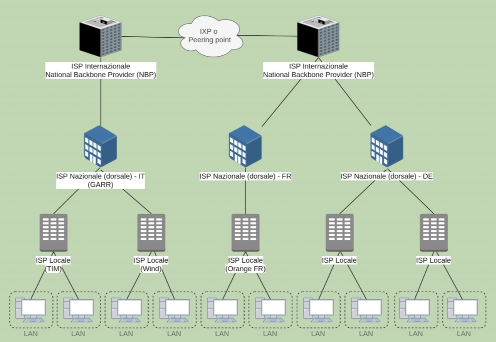

# Livello di rete

Gli indirizzi IP servono per **identificare univocamente un host all'interno della rete**. Sono associati alle schede di rete degli host, ma a differenza dei MAC address sono dinamici e l'identificazione univoca è circoscritta ad un determinato arco temporale.

Nello specifico, un indirizzo IP (o meglio IPv4) è un codice composto da **$4$ blocchi di numeri che vanno da $0$ a $255$**.
Per esprimere ogni porzione dell'indirizzo utilizziamo **$8$ bit**, da qui il range di valori ottenibili. Essendoci $4$ blocchi da $8$ bit ciascuno un indirizzo IP è costituito da **$32$ bit** totali.

In termini di potenze di $2$ ossiamo quindi esprimere $2^{32}$ indirizzi, ovvero $4294967296$​.

Alcuni esempi di indirizzi IP sono:

- `192.168.1.1.13` 
- `10.3.2.1`
- `255.255.255.255`
- `0.0.0.0`

## IPv6

La versione 6 del protocollo IP, nota come IPv6, differisce dal predecessore per struttura e capacità di indirizzamento.
In questo caso vengono utilizzati indirizzi a $128$ bit, espressi in notazione esadecimale. Sono dunque indicizzabili $2^{128}$ host, ovvero abbiamo a disposizione $3.402823669 * 10^{38}$ indirizzi.

Un esempio di indirizzo IPv6 è ad esempio: `fe80:0000:0000:0000:51e1:6d16:55a:1bd`, cui zeri consecutivi possono venire compatati secondo al notazione breve `fe80::51e1:6d16:55a:1bd`

## Struttura dei datagrammi IP

A questo livello l'unità di trasferimento dati è detta **datagramma (IP datagram)**. Ne studiamo alcuni aspetti caratteristici.


- **Version**: campo contenente la versione del protocollo (4 per IPv4 e 6 per IPv6)
- **Header length**: lunghezza dell'intestazione IP
- **Datagram length** (o total length): lunghezza totale del datagramma
- **Identificativo** a 16 bit
- **Time to live (TTL)**: intero che viene decrementato ad ogni hop verso un nuovo router. Utilizzato per evitare che il datagramma rimbalzi tra i router in loop, una volta giunto a zero infatti viene scartato e la sua vita all'interno della rete termina.
- **Upper-layer protocol:** a quale protocollo di livello superiore sono destianti i dati
- **Header checksum**: controllo di integrità relativo alle intestazioni
- **Indirizzo sorgente**
- **Indirizzo di destinazione**
- **Data / payload**

I router possono analizzare e modificare gli header di livello IP. A livello IP avviene il **routing**, ovvero la scelta del percorso per arrivare da host A ad host B. Possono esserci più percorsi fattibili. Il routing si occupa di trovare il percorso ideale.

Il livello IP fornisce una consegna **non affidabile**, questo perché è **connection-less**. Ogni pacchetto è indipendente da tutti gli altri. Come per UDP, diciamo che in questo caso la consegna è **best-effort**

## Protocollo ARP

Il protocollo che lega gli indirizzi IP e gli indirizzi MAC, identificativi univoci delle schede di rete, è l**'Address Resolution Protocol (ARP)**.

Un host che, disponendo di un indirizzo IP, voglia scoprire a chi appartenga, invia un messaggio in broadcast, formulando una **ARP request**. Risponderà il solo host interessato (**ARP response**). L'indirizzo MAC dell'host che ha fornito la risposta verrà poi salvato in una ARP cache (nota anche come ARP table) risiedente sull'host che ha formulato la richiesta inizialmente. L'ARP cache contenente tutte le associazioni IP - MAC che l'host ha registrato fino a quel momento.

Potete visualizzare la vostra tabella ARP con il comando

```bash
$ arp -a
```

È bene ricordare che, essendo gli indirizzi IP dinamici, prima o poi verranno inviate nuove richieste e gli indirizzi aggiornati, di conseguenza i dati nell'ARP cache variano in funzione di questi cambiamenti.

## Classi di indirizzi

In un indirizzo IP troviamo due parti, la cui suddivisione non è sempre uguale ma varia a seconda di alcune considerazioni che faremo alla fine di questo paragrafo.

- **Identificativo della rete (netID)**
- **Identificativo dell'host (hostID)**

Com'è intuibile, il primo identifica la rete nel suo complesso, mentre il secondo permette di identificare l'host all'interno della rete. 

Supponiamo di avere un indirizzo del tipo `192.168.0.0` e che i primi tre gruppi costituiscano l'identificativo della rete. `192.168.0.0` e `192.168.1.0` sono quindi due reti differenti. In maniera analoga `192.168.0.1` e `192.168.0.2` potrebbero essere indirizzi di due host distinti appartenenti alla rete `192.168.0.0`.

Possiamo decidere arbitrariamente come ripartire la parte dedicata ad identificare la rete e quella atta ad identificare l'host tramite la cosiddetta **maschera di rete (netmask o sub-netmask)**. Una maschera di rete non è nient'altro che una stringa di bit che, addizionata alla rappresentazione binaria dell'indirizzo di rete, definisce la porzione destinata a rappresentare la rete (e di conseguenza il restante rappresenta gli host).

A seconda del valore assunto, la maschera di rete può essere (e generare un indirizzo di tipo) **classful** oppure **classless**. Esaminiamo la notazione che utilizza le classi per prima.

Suddividiamo gli indirizzi in classi, a seconda della maschera impiegata

| CLASSE | ID RETE     | MASCHERA CON / | MASCHERA IN O - 255 | N. HOST         |
| ------ | ----------- | -------------- | ------------------- | --------------- |
| A      | **a**.x.x.x | /8             | 255.0.0.0           | Da 0 a 16777214 |
| B      | **b.b**.x.x | /16            | 255.255.0.0         | Da 0 a 65534    |
| C      | **c.c.c**.x | /24            | 255.255.255.0       | Da 0 a 254      |

Per ciascuna rete possiamo quindi avere un numero di host pari a
$$
2^{netmask\_bit} - 2
$$
Sottraiamo due indirizzi perchè **utilizziamo rispettivamente il primo e l'ultimo indirizzo del range per indicare la rete nel suo complesso e per il broadcast**.

L'indirizzo IP è assegnato alla schede di rete dell'host, va da se che se l'host ha più schede di rete possiamo avere più indirizzi IP. Gli indirizzi IP sono logici e dinamici, possono essere assegnati:

- **tramite DHCP** (dinamicamente)
  - Il server DHCP è pre-installato sui router di casa, aziendali, delle università e delle scuole.

- **staticamente**
  - Che possiamo trovare definita su sistemi Linux al path `/etc/network/interfaces`


## Indirizzi IP speciali

Non tutti gli indirizzi IP sono utilizzabili per navigare su internet. Alcuni di questi vengono utilizzati per uso interno, altre funzionalità oppure sono stati sprecati a causa di una cattiva progettazione agli albori. Alcuni esempi di indirizzi speciali sono:

- `127.0.0.1` indicano il medesimo host, noto anche come **localhost**
- `0.0.0.0` indirizzo tipicamente non valido. È utilizzato per indicare tutti gli IP associati ad un determianto host
- `192.168.1.255` indirizzo di broadcast per la rete `192.168.1.0`
- `255.255.255.255` indirizzo di broadcast per la rete in cui siamo, indipendentemente dal suo prefisso
- Da `224.0.0.0` a `239.255.255.255` indirizzi di classe D, riservati per il multicast
- Da `240.0.0.0` a `255.255.255.254` indirizzi di classe E, originariamente destinati a sviluppi futuri

## CIDR, Subnetting e supernetting

La suddivisione in classi ci permette di creare reti con un numero ridotto di host, nel caso ad esempio della classe C, o reti con un numero esagerato di host, come nel caso delle classi B ed A. Possiamo definire reti con maggiore granularità rispetto a quella offerta dalle classi. Per fare questo usiamo netmask differenti da quelle già viste.

Supponiamo ad esempio di usare una netmask di tipo `/23`, ovvero `255.255.254.0`. Abbiamo quindi $9$ bit per identificare gli host. In questo caso possiamo avere $2^9 - 2$ indirizzi possibili per gli host, ovvero fino a $510$ host.

L'utilizzo di una maschera più bassa per la costruzione di una rete più ampia è detta **supernetting**.
Potete calcolare gli indirizzi con la util `ipcalc` indicando indirizzo e netmask.

```bash
$ ipcalc 192.168.1.1/23
```

```bash
[makapx@archlinux ~]$ ipcalc 192.168.1.1/23
Address:   192.168.1.1          11000000.10101000.0000000 1.00000001
Netmask:   255.255.254.0 = 23   11111111.11111111.1111111 0.00000000
Wildcard:  0.0.1.255            00000000.00000000.0000000 1.11111111
=>
Network:   192.168.0.0/23       11000000.10101000.0000000 0.00000000
HostMin:   192.168.0.1          11000000.10101000.0000000 0.00000001
HostMax:   192.168.1.254        11000000.10101000.0000000 1.11111110
Broadcast: 192.168.1.255        11000000.10101000.0000000 1.11111111
Hosts/Net: 510                   Class C, Private Internet
```

Possiamo anche eseguire l'operazione complementare, ovvero frammentare reti in sottoreti più piccole incrementando la maschera di rete. In questo caso parliamo di **subnetting**.

Gli indirizzi provenienti da queste operazioni sono di tipo **CIDR (Classless inter-domain routing)**

## NAT e Natting

Per ciascuna classe troviamo degli indirizzi particolari, detti **non routable**, ovvero non soggetti a routing. Questo tipo di indirizzi non possono essere utilizzati per navigare in internet e più in generale per indicizzare il traffico nelle reti esterne, sono infatti anche detti **privati**.

- Classe A
  Da `10.0.0.0` a `10.255.255.255` (`10.0.0.0/8`)
- Classe B
  Da `172.16.0.0` a `172.31.255.255` (`172.16.0.0/12`)
- Classe C
  Da `192.168.0.0` a `192.168.255.255` (`192.168.0.0/16`)

Ogni realtà può usare questi indirizzi localmente e "uscire" su internet utilizzando poi un indirizzo pubblico, assegnato al router. Questi indirizzi privati sono circoscritti quindi alla cosiddetta **local area network (LAN)** e non è inusuale che due reti locali differenti abbiano stessi indirizzi al proprio interno. Questo sistema permette di ridurre gli indirizzi IP pubblici e non espone direttamente gli host interni su internet. Una rete di questo tipo è anche detta **semi-privata**.

Sorge a questo punto spontaneo il dubbio su come, in presenza di una rete privata, si possa uscire verso la rete.
In questi casi il nostro host all'interno della LAN invia al router un pacchetto, specificando la destinazione (al di fuori dalla LAN). Il router sostituisce quindi l'indirizzo sorgente, privato, con il proprio, prima di inoltrarlo sulla rete. Questo indirizzo verrà poi utilizzato dal server in fase di generazione della risposta ed inoltro indietro del messaggio.

Il router tiene traccia delle richieste originali così, in fase di ricezione della risposta, sostituisce nuovamente l'indirizzo (questa volta di destinazione) e lo inoltra all'host presente nella LAN. Questo processo è noto come **NAT**. È un'operazione di traduzione tra la rete esterna e la LAN. Nello specifico questa operazione che parte dalla LAN e va verso l'esterno è detta **source natting**.

È anche possibile fare **destination natting**, ovvero esporre un determinato servizio, residente su un host che si trova all'interno di una rete locale, in modo tale che i router a confine della LAN inoltrino verso di esso le richieste in ingresso.

## Internet architetture



Dal punto di vista organizzativo Internet è un insieme di più **Autonomous Systems (AS)**.
Un Autonomous System è un insieme di reti, indirizzi IP e router sotto il controllo di una organizzazione (o consorzio di organizzazioni) nell'ambito del quale si utilizza una determinata politica di **interior routing**. Le specifiche degli Autonomous Systems sono definite nel [RFC 1930](https://datatracker.ietf.org/doc/html/rfc1930).
Gli AS sono le unità dalle politiche di exterior routing, come nel caso dei BGP.

Un AS gestisce quindi regioni di reti, all'interno di suddette regioni il routing è da vedersi come interno. Ad oggi nessun AS gestisce più del 5% del traffico mondiale.

Gli AS si collegano tra loro tramite **peering point** oppure **IXP**, dei collegamenti dedicati. Le spese per creare e mantenere il collegamento possono essere a spese di uno solo o divise equamente da entrambi.


## Routing

I router hanno il compito di mettere in comunicazione sotto-reti differenti. Per farlo devono disporre almeno di due interfacce di rete, un rivolta verso la prima rete e una verso l'altra. Lo scopo principale del router è trovare il percorso adatto per i nostri messaggi, affinché questi riescano a giungere alla destinazione prefissata.

L'indirizzamento di un dato datagramma presso la destinazione avviene nel seguente modo.
Dal nostro computer inoltriamo al **default gateway**, tipicamente il router di casa, e questo lo inoltra:

- o ad uno dei gateway a lui collegato se l'indirizzo fornito nel messaggio corrisponde ai range offerti da uno di questi
- o al suo default gateway

Questo si ripete in maniera iterativa, fino a raggiungere l'host di destinazione.

Per fare ciò ogni nodo appartenente alla rete (e anche il nostro computer) possiede una **tabella di routing**.
È possibile visualizzare la propria tabella di routing utilizzando il comando `ip route`.

```bash
[makapx@archlinux ~]$ ip route
default via 192.168.1.1 dev wlan0 proto dhcp src 192.168.1.195 metric 600 
172.17.0.0/16 dev docker0 proto kernel scope link src 172.17.0.1 linkdown 
192.168.1.0/24 dev wlan0 proto kernel scope link src 192.168.1.195 metric 600 
```

Nel caso non sia registrato un default gateway otteniamo un errore di routing. Gli errori di routing possono compromettere l'instradamento del nostro pacchetto, impedendogli di arrivare a destinazione e generando eventi di congestione nella rete. Per evitare che in caso di errori di routing il messaggio venga inoltrato in loop nella rete decrementiamo progressivamente il campo **TTL** ad ogni hop da un router ad un altro.

Sarebbe ideale raggiungere la destinazione desiderata facendo il tragitto più breve possibile. Il calcolo dei cammini minimi può avvenire utilizzando differenti tipi di algoritmi.

- **algoritmi di routing globale**
  - tutti i nodi conoscono lo stato dell'intera rete, come ad esempio nel **Link State Protocol**
- **algoritmi di routing locale**
  - ogni nodo comunica il suo stato solamente ai vicini, come ad esempio il **Distance Vector Protocol**

Entrambe queste tipologie possono venire utilizzate all'interno degli AS, oppure per mettere in comunicazione due AS differenti.  Solitamente **gli algoritmi di tipo globale sono utilizzati internamente agli AS**, mentre **quelli locali per mettere in comunicazione due AS**.

## ICMP

L' **Internet Control Message Protocol (ICMP)** è un protocollo per la diagnostica che ci permette di avere informazioni sullo stato della rete.

È utilizzato per:

-  Controllo di flusso dei datagram
-  Determinare cicli o cammini troppo lunghi
-  Misurare latenza tra mittente e destinatario

È utilizzato da protocolli come **Ping** e **Tracerouter**.
Concettualmente Ping è un sistema echo, mandata una richiesta e ricevuta una risposta, viene calcolato il tempo di percorrenza verso un determinato host.

Traceroute permette invece di tracciare il percorso fatto dal pacchetto e per ogni host attraversato viene inoltrato un ping indietro. Alcuni host potrebbero essere configurati per rifiutare le richieste di ping e quindi non rispondere, in questo caso appaiono come anonimi (con gli * )

------

**Link utili**

- [What is an autonomous system? | What are ASNs?](https://www.cloudflare.com/it-it/learning/network-layer/what-is-an-autonomous-system/)

